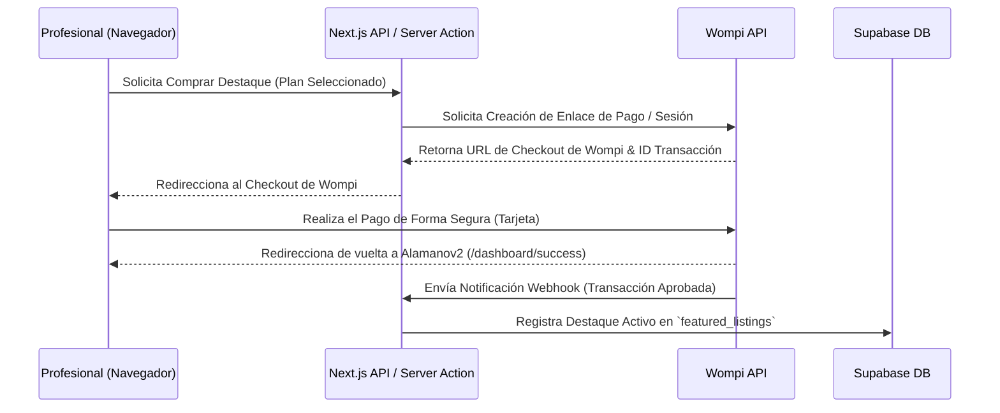

# Módulo 4: Monetización e Integración con Wompi (El Salvador)

Este módulo describe la estrategia de monetización de la plataforma, enfocada en la venta de perfiles destacados y espacios publicitarios patrocinados, utilizando la pasarela de pagos **Wompi** (Banco Agrícola, El Salvador).

---

## 1. Planes de Destaque para Profesionales

Los profesionales podrán comprar "Destaques" para que su perfil aparezca primero en el Marketplace, tenga un borde dorado y muestre una insignia de "Destacado".

### Tabla de Tarifas Sugeridas (El Salvador)
| Plan de Destaque | Duración | Beneficios | Costo |
| :--- | :--- | :--- | :--- |
| **Destaque Bronce** | 7 días | Aparece arriba de perfiles normales, insignia de destacado. | $2.99 USD |
| **Destaque Plata** | 15 días | Aparece arriba de Bronce, insignia animada, estadísticas básicas. | $4.99 USD |
| **Destaque Oro (Recomendado)** | 30 días | Top de búsquedas, carrusel de inicio, banner especial, estadísticas avanzadas. | $8.99 USD |

---

## 2. Flujo de Integración de Pagos con Wompi

Utilizaremos la API de Wompi El Salvador para procesar pagos de forma segura con tarjetas de crédito y débito.

### Diagrama de Proceso de Pago

### Endpoints Clave a Implementar
1. **Creación del Enlace de Pago (`/api/payments/wompi-checkout`):**
   * Endpoint protegido que recibe el ID del perfil y el plan.
   * Llama a la API de Wompi enviando el monto del plan, moneda (USD), descripción, e ID de referencia propio.
   * Guarda un registro temporal de la transacción pendiente en base de datos.
   * Retorna la URL del portal de pagos de Wompi al frontend para redirigir al usuario.

2. **Recepción de Webhook de Wompi (`/api/webhooks/wompi`):**
   * Endpoint público expuesto para que Wompi notifique los estados de transacción.
   * **Seguridad Obligatoria:** Verificación de la firma criptográfica utilizando la clave `WOMPI_WEBHOOK_SECRET` para garantizar que la petición proviene legítimamente de Wompi.
   * Si el estado es `APPROVED` (Aprobado):
     * Actualiza la tabla `featured_listings` para activar el destaque.
     * Calcula la fecha de expiración (`end_date`) sumando los días correspondientes del plan (7, 15 o 30 días).
     * Cambia el flag `is_active` a `true`.

---

## 3. Espacios para Anuncios de Patrocinadores (Publicidad de Banner)

Además de los destaques de profesionales, se habilitará la colocación de banners publicitarios externos para empresas afines (ej. ferreterías, escuelas técnicas, distribuidoras de materiales).

### Implementación del MVP para Anuncios
* **Estructura Simple:** Colección de Supabase `sponsored_ads` que contiene la URL de la imagen (Cloudinary), el enlace de redirección, y la ubicación en pantalla (ej. "sidebar", "search_footer").
* **Visualización:** Componentes React con diseño limpio de banners que se mezclan de forma no intrusiva entre las tarjetas de resultados del Marketplace o en la barra lateral.
